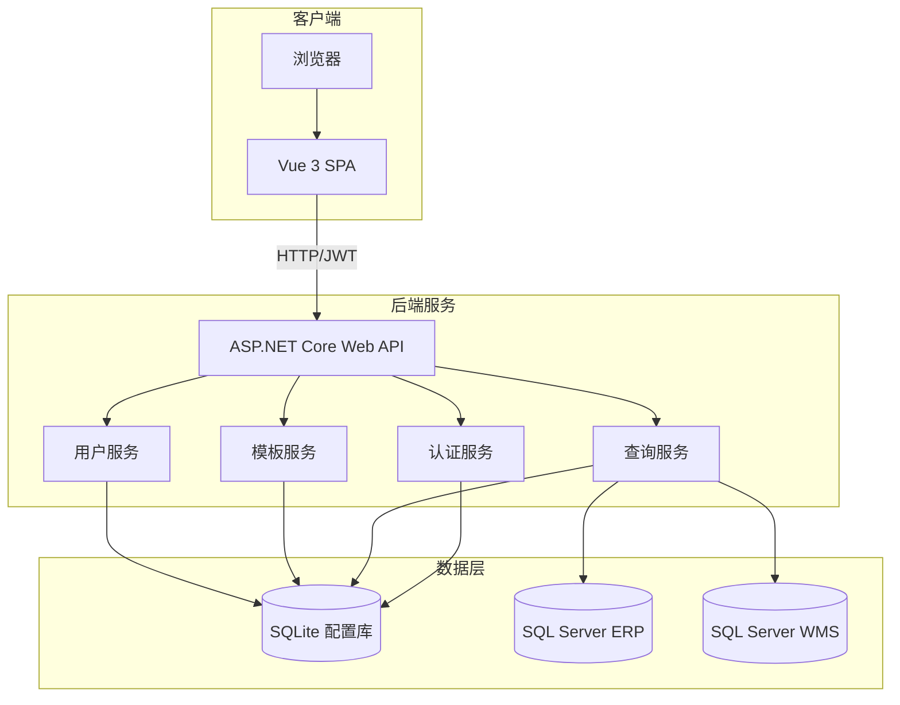

# AIDataQuery 设计文档

## 概述

本文档描述 AIDataQuery 数据查询中心系统的详细设计，包括系统架构、组件设计、数据模型、API 接口和前端页面布局。

---

## 系统架构

### 整体架构图



### 模块化设计原则

- **单文件职责**：每个文件只处理一个特定关注点或领域
- **组件隔离**：创建小型、聚焦的组件而非大型单体文件
- **服务层分离**：分离数据访问、业务逻辑和表现层
- **工具模块化**：将工具函数拆分为聚焦、单一用途的模块

---

## 后端组件设计（三层架构）

### 架构说明

采用经典三层架构，Service 层直接使用 EF Core DbContext 进行数据操作，无需额外的 Repository 层：

```
Controller (表现层) → Service (业务逻辑层) → DbContext (数据访问层)
```

### 组件 1: AuthService (认证服务)

**职责：** 处理用户登录、令牌生成和验证

**接口：**
```csharp
public interface IAuthService
{
    Task<LoginResult> LoginAsync(LoginRequest request);
    Task<bool> ValidateTokenAsync(string token);
    Task<UserInfo> GetCurrentUserAsync();
    Task LogoutAsync();
}
```

**依赖：** AppDbContext, IJwtTokenGenerator

---

### 组件 2: QueryService (查询服务)

**职责：** 执行 SQL 查询，管理数据库连接

**接口：**
```csharp
public interface IQueryService
{
    Task<QueryResult> ExecuteQueryAsync(QueryRequest request);
    Task<IEnumerable<TableInfo>> GetTablesAsync(string connectionId);
    Task<IEnumerable<ColumnInfo>> GetColumnsAsync(string connectionId, string tableName);
    Task<bool> TestConnectionAsync(string connectionId);
}
```

**依赖：** AppDbContext, ISqlValidator

---

### 组件 3: TemplateService (模板服务)

**职责：** 管理 SQL 查询模板

**接口：**
```csharp
public interface ITemplateService
{
    Task<IEnumerable<TemplateModule>> GetModulesAsync();
    Task<IEnumerable<QueryTemplate>> GetTemplatesByModuleAsync(string moduleId);
    Task<QueryTemplate> GetTemplateAsync(int templateId);
    Task<QueryTemplate> CreateTemplateAsync(CreateTemplateRequest request);
    Task UpdateTemplateAsync(int templateId, UpdateTemplateRequest request);
    Task DeleteTemplateAsync(int templateId);
}
```

**依赖：** AppDbContext

---

### 组件 4: UserService (用户服务)

**职责：** 用户和权限管理

**接口：**
```csharp
public interface IUserService
{
    Task<PagedResult<UserDto>> GetUsersAsync(UserQueryParams queryParams);
    Task<UserDto> GetUserAsync(int userId);
    Task<UserDto> CreateUserAsync(CreateUserRequest request);
    Task UpdateUserAsync(int userId, UpdateUserRequest request);
    Task SetUserPermissionsAsync(int userId, UserPermissionRequest request);
    Task DisableUserAsync(int userId);
}
```

**依赖：** AppDbContext

---

## 数据模型

### 用户相关

```
┌─────────────────────────────────────────────────────────────────┐
│                           Users                                  │
├─────────────────────────────────────────────────────────────────┤
│ Id              : int (PK, Auto)                                │
│ Username        : nvarchar(50) (Unique, Not Null)               │
│ PasswordHash    : nvarchar(255) (Not Null)                      │
│ Nickname        : nvarchar(50) (Not Null)                       │
│ Email           : nvarchar(100)                                 │
│ Role            : int (0=User, 1=Admin)                         │
│ Status          : int (0=Disabled, 1=Active)                    │
│ ThemePreference : nvarchar(20) (Default='auto')                 │
│ CreatedAt       : datetime (Not Null)                           │
│ UpdatedAt       : datetime                                      │
│ LastLoginAt     : datetime                                      │
└─────────────────────────────────────────────────────────────────┘

┌─────────────────────────────────────────────────────────────────┐
│                    UserPlatformPermissions                       │
├─────────────────────────────────────────────────────────────────┤
│ Id              : int (PK, Auto)                                │
│ UserId          : int (FK -> Users.Id)                          │
│ PlatformCode    : nvarchar(50) (FK -> Platforms.Code)           │
│ CreatedAt       : datetime (Not Null)                           │
└─────────────────────────────────────────────────────────────────┘
```

### 平台与数据库连接

**重要说明：** 业务数据库连接字符串存储在 SQLite 配置库的 `DatabaseConnections` 表中，使用 AES-256 加密。管理员通过管理界面配置连接，无需修改配置文件。

```
┌─────────────────────────────────────────────────────────────────┐
│                          Platforms                               │
├─────────────────────────────────────────────────────────────────┤
│ Id              : int (PK, Auto)                                │
│ Code            : nvarchar(50) (Unique, Not Null)               │
│ Name            : nvarchar(100) (Not Null)                      │
│ Description     : nvarchar(500)                                 │
│ IsActive        : bit (Default=1)                               │
│ SortOrder       : int (Default=0)                               │
│ CreatedAt       : datetime (Not Null)                           │
└─────────────────────────────────────────────────────────────────┘

┌─────────────────────────────────────────────────────────────────┐
│                      DatabaseConnections                         │
│          (连接字符串 AES 加密存储，通过管理界面配置)                │
├─────────────────────────────────────────────────────────────────┤
│ Id              : int (PK, Auto)                                │
│ Name            : nvarchar(100) (Not Null)                      │
│ PlatformCode    : nvarchar(50) (FK -> Platforms.Code)           │
│ ConnectionString: nvarchar(1000) (Not Null, AES-256 Encrypted)  │
│ DatabaseType    : nvarchar(20) (Default='SqlServer')            │
│ Description     : nvarchar(500)                                 │
│ IsActive        : bit (Default=1)                               │
│ SortOrder       : int (Default=0)                               │
│ CreatedAt       : datetime (Not Null)                           │
│ UpdatedAt       : datetime                                      │
└─────────────────────────────────────────────────────────────────┘
```

**连接管理流程：**
1. 管理员登录系统，进入"连接管理"页面
2. 点击"新增连接"，输入连接名称、选择平台、填写连接字符串
3. 系统自动使用 AES-256 加密连接字符串后存储
4. 可点击"测试连接"验证配置是否正确
5. 用户执行查询时，系统从数据库读取并解密连接字符串

### 模板相关

```
┌─────────────────────────────────────────────────────────────────┐
│                       TemplateModules                            │
├─────────────────────────────────────────────────────────────────┤
│ Id              : int (PK, Auto)                                │
│ Name            : nvarchar(50) (Not Null)                       │
│ ParentId        : int (FK -> TemplateModules.Id, Nullable)      │
│ Icon            : nvarchar(50)                                  │
│ SortOrder       : int (Default=0)                               │
│ IsActive        : bit (Default=1)                               │
│ CreatedAt       : datetime (Not Null)                           │
└─────────────────────────────────────────────────────────────────┘

┌─────────────────────────────────────────────────────────────────┐
│                       QueryTemplates                             │
├─────────────────────────────────────────────────────────────────┤
│ Id              : int (PK, Auto)                                │
│ ModuleId        : int (FK -> TemplateModules.Id)                │
│ Name            : nvarchar(100) (Not Null)                      │
│ SqlContent      : ntext (Not Null)                              │
│ Description     : nvarchar(500)                                 │
│ IsPublic        : bit (Default=0)                               │
│ CreatedBy       : int (FK -> Users.Id)                          │
│ SortOrder       : int (Default=0)                               │
│ CreatedAt       : datetime (Not Null)                           │
│ UpdatedAt       : datetime                                      │
└─────────────────────────────────────────────────────────────────┘
```

### 查询日志

```
┌─────────────────────────────────────────────────────────────────┐
│                         QueryLogs                                │
├─────────────────────────────────────────────────────────────────┤
│ Id              : long (PK, Auto)                               │
│ UserId          : int (FK -> Users.Id)                          │
│ PlatformCode    : nvarchar(50)                                  │
│ DatabaseName    : nvarchar(100)                                 │
│ SqlContent      : ntext (Not Null)                              │
│ ExecutionTimeMs : int                                           │
│ RowCount        : int                                           │
│ Status          : int (0=Failed, 1=Success)                     │
│ ErrorMessage    : nvarchar(2000)                                │
│ ClientIp        : nvarchar(50)                                  │
│ CreatedAt       : datetime (Not Null)                           │
└─────────────────────────────────────────────────────────────────┘
```

### ER 图

```
┌──────────┐       ┌──────────────────────┐       ┌──────────────┐
│  Users   │──1:N──│ UserPlatformPerms    │──N:1──│  Platforms   │
└──────────┘       └──────────────────────┘       └──────────────┘
     │                                                   │
     │                                                   │
     │1:N                                               1:N
     │                                                   │
     ▼                                                   ▼
┌──────────┐                                    ┌──────────────────┐
│QueryLogs │                                    │DatabaseConnections│
└──────────┘                                    └──────────────────┘

┌──────────┐       ┌──────────────────────┐
│  Users   │──1:N──│   QueryTemplates     │──N:1──┌────────────────┐
└──────────┘       └──────────────────────┘       │TemplateModules │
                                                  └────────────────┘
                                                         │ 自引用
                                                         └──1:N──┘
```

---

## API 接口设计

### 认证接口

| 方法 | 路径 | 描述 | 权限 |
|------|------|------|------|
| POST | /api/auth/login | 用户登录 | Public |
| POST | /api/auth/logout | 用户登出 | Authenticated |
| GET | /api/auth/me | 获取当前用户信息 | Authenticated |
| POST | /api/auth/change-password | 修改密码 | Authenticated |

### 用户管理接口

| 方法 | 路径 | 描述 | 权限 |
|------|------|------|------|
| GET | /api/users | 获取用户列表 | Admin |
| GET | /api/users/{id} | 获取用户详情 | Admin |
| POST | /api/users | 创建用户 | Admin |
| PUT | /api/users/{id} | 更新用户 | Admin |
| PUT | /api/users/{id}/permissions | 设置用户权限 | Admin |
| DELETE | /api/users/{id} | 禁用用户 | Admin |

### 平台与数据库接口

| 方法 | 路径 | 描述 | 权限 |
|------|------|------|------|
| GET | /api/platforms | 获取平台列表 | Authenticated |
| GET | /api/platforms/{code}/connections | 获取平台下的数据库连接 | Authenticated |
| POST | /api/connections | 创建数据库连接 | Admin |
| PUT | /api/connections/{id} | 更新数据库连接 | Admin |
| POST | /api/connections/{id}/test | 测试数据库连接 | Admin |
| DELETE | /api/connections/{id} | 删除数据库连接 | Admin |

### 查询接口

| 方法 | 路径 | 描述 | 权限 |
|------|------|------|------|
| POST | /api/query/execute | 执行 SQL 查询 | Authenticated |
| GET | /api/query/tables | 获取表列表 | Authenticated |
| GET | /api/query/columns | 获取字段列表 | Authenticated |
| POST | /api/query/export | 导出查询结果 | Authenticated |

### 模板接口

| 方法 | 路径 | 描述 | 权限 |
|------|------|------|------|
| GET | /api/templates/modules | 获取模块树 | Authenticated |
| GET | /api/templates | 获取模板列表 | Authenticated |
| GET | /api/templates/{id} | 获取模板详情 | Authenticated |
| POST | /api/templates | 创建模板 | Authenticated |
| PUT | /api/templates/{id} | 更新模板 | Authenticated |
| DELETE | /api/templates/{id} | 删除模板 | Authenticated |

### 查询历史接口

| 方法 | 路径 | 描述 | 权限 |
|------|------|------|------|
| GET | /api/query-logs | 获取查询历史 | Authenticated |
| GET | /api/query-logs/all | 获取所有用户查询历史 | Admin |

---

## 前端页面设计

### 页面路由结构

```
/
├── /login                    # 登录页
├── /                         # 主页面（重定向到 /query）
│   ├── /query                # 数据查询页（默认）
│   ├── /templates            # 模板管理页
│   ├── /history              # 查询历史页
│   └── /admin                # 管理页面（仅管理员）
│       ├── /admin/users      # 用户管理
│       ├── /admin/platforms  # 平台管理
│       └── /admin/connections # 数据库连接管理
└── /404                      # 404 页面
```

### 页面布局

#### 1. 整体布局结构

```
┌─────────────────────────────────────────────────────────────────────────────┐
│                              顶部导航栏 (Header)                             │
│  ┌─────────┐                                      ┌─────┐ ┌─────┐ ┌──────┐ │
│  │  Logo   │   数据查询   模板管理   查询历史      │主题 │ │用户 │ │ 退出 │ │
│  └─────────┘                                      └─────┘ └─────┘ └──────┘ │
├─────────────────────────────────────────────────────────────────────────────┤
│                                                                             │
│                                                                             │
│                              主内容区域 (Main Content)                       │
│                                                                             │
│                                                                             │
│                                                                             │
│                                                                             │
│                                                                             │
│                                                                             │
└─────────────────────────────────────────────────────────────────────────────┘
```

#### 2. 登录页面

```
┌─────────────────────────────────────────────────────────────────────────────┐
│                                                                             │
│                                                                             │
│                       ┌─────────────────────────────────┐                   │
│                       │        AIDataQuery              │                   │
│                       │         数据查询中心             │                   │
│                       │                                 │                   │
│                       │  ┌───────────────────────────┐  │                   │
│                       │  │  用户名                    │  │                   │
│                       │  └───────────────────────────┘  │                   │
│                       │                                 │                   │
│                       │  ┌───────────────────────────┐  │                   │
│                       │  │  密码                      │  │                   │
│                       │  └───────────────────────────┘  │                   │
│                       │                                 │                   │
│                       │  □ 记住我                       │                   │
│                       │                                 │                   │
│                       │  ┌───────────────────────────┐  │                   │
│                       │  │         登 录              │  │                   │
│                       │  └───────────────────────────┘  │                   │
│                       └─────────────────────────────────┘                   │
│                                                                             │
└─────────────────────────────────────────────────────────────────────────────┘
```

#### 3. 数据查询页面（核心页面）

```
┌─────────────────────────────────────────────────────────────────────────────┐
│  Logo   数据查询   模板管理   查询历史   [管理]     🌙  👤Admin  [退出]      │
├─────────────────────────────────────────────────────────────────────────────┤
│                                                                             │
│  ┌──────────────────────────────────────────────────────────────────────┐  │
│  │ 平台选择: [ERP_YYY_GXXQ ▼]    数据库: [【正式】ERP系统-药约约-高新西区-ERP ▼] │  │
│  └──────────────────────────────────────────────────────────────────────┘  │
│                                                                             │
│  ┌─────────────────────────┬────────────────────────────────────────────┐  │
│  │      模板列表           │               SQL 编辑器                    │  │
│  │  ┌───────────────────┐  │  ┌────────────────────────────────────────┐│  │
│  │  │ ▼ 客户模块        │  │  │ SELECT                                 ││  │
│  │  │   ├─ KEY查询      │  │  │     wldwid,                            ││  │
│  │  │   ├─ 基础查询     │  │  │     wldwname,                          ││  │
│  │  │   ├─ 区域查询     │  │  │     pym,                               ││  │
│  │  │   ├─ 发票查询     │  │  │     kehufl                             ││  │
│  │  │   ├─ 发货查询     │  │  │ FROM wldwzl                            ││  │
│  │  │   ├─ 经营范围     │  │  │ WHERE wldwid = 'WLTH0054225';          ││  │
│  │  │   └─ 证照查询     │  │  │                                        ││  │
│  │  │ ▶ 商品模块        │  │  │                                        ││  │
│  │  │ ▶ 订单模块        │  │  │                                        ││  │
│  │  │ ▶ 库存模块        │  │  └────────────────────────────────────────┘│  │
│  │  │ ▶ 自定义模板      │  │                                            │  │
│  │  └───────────────────┘  │  [执行查询 F5] [保存模板] [格式化] [清空]   │  │
│  │                         │                                            │  │
│  │  ┌───────────────────┐  ├────────────────────────────────────────────┤  │
│  │  │  快捷搜索:        │  │               查询结果                      │  │
│  │  │  [搜索模板...   ] │  │  ┌────────────────────────────────────────┐│  │
│  │  └───────────────────┘  │  │ wldwid    │ wldwname    │ pym  │ kehufl ││  │
│  │                         │  ├───────────┼─────────────┼──────┼────────┤│  │
│  │                         │  │ WLTH005.. │ 某某药店    │ MMYD │ 零售   ││  │
│  │                         │  │ WLTH006.. │ 某某医院    │ MMYY │ 医疗   ││  │
│  │                         │  │ ...       │ ...         │ ...  │ ...    ││  │
│  │                         │  └────────────────────────────────────────┘│  │
│  │                         │                                            │  │
│  │                         │  共 125 条记录 | 耗时 0.235s | [导出CSV] [导出Excel] │  │
│  └─────────────────────────┴────────────────────────────────────────────┘  │
│                                                                             │
└─────────────────────────────────────────────────────────────────────────────┘
```

#### 4. 模板管理页面

```
┌─────────────────────────────────────────────────────────────────────────────┐
│  Logo   数据查询   模板管理   查询历史   [管理]     🌙  👤Admin  [退出]      │
├─────────────────────────────────────────────────────────────────────────────┤
│                                                                             │
│  ┌─────────────────────────────────────────────────────────────────────┐   │
│  │  模板管理                                            [+ 新建模块]    │   │
│  └─────────────────────────────────────────────────────────────────────┘   │
│                                                                             │
│  ┌───────────────────────┬─────────────────────────────────────────────┐   │
│  │     模块树            │                模板列表                      │   │
│  │  ┌─────────────────┐  │  ┌─────────────────────────────────────────┐│   │
│  │  │ 全部模板        │  │  │ 搜索: [输入模板名称...]  [+ 新建模板]   ││   │
│  │  │ ▼ 客户模块 [编辑]│  │  ├─────────────────────────────────────────┤│   │
│  │  │   ├─ KEY查询    │  │  │                                         ││   │
│  │  │   ├─ 基础查询   │  │  │  名称        │ 模块     │ 创建人 │ 操作 ││   │
│  │  │   ├─ 区域查询   │  │  │ ─────────────┼──────────┼────────┼──────││   │
│  │  │   └─ ...        │  │  │  KEY查询     │ 客户模块 │ admin  │ 编辑 ││   │
│  │  │ ▶ 商品模块 [编辑]│  │  │  基础查询   │ 客户模块 │ admin  │ 编辑 ││   │
│  │  │ ▶ 订单模块 [编辑]│  │  │  区域查询   │ 客户模块 │ user1  │ 编辑 ││   │
│  │  │ ▶ 自定义 [编辑]  │  │  │  ...        │ ...      │ ...    │ ...  ││   │
│  │  │                 │  │  │                                         ││   │
│  │  │ [+ 新建模块]    │  │  └─────────────────────────────────────────┘│   │
│  │  └─────────────────┘  │                                             │   │
│  └───────────────────────┴─────────────────────────────────────────────┘   │
│                                                                             │
└─────────────────────────────────────────────────────────────────────────────┘
```

#### 5. 查询历史页面

```
┌─────────────────────────────────────────────────────────────────────────────┐
│  Logo   数据查询   模板管理   查询历史   [管理]     🌙  👤Admin  [退出]      │
├─────────────────────────────────────────────────────────────────────────────┤
│                                                                             │
│  ┌─────────────────────────────────────────────────────────────────────┐   │
│  │  查询历史                                                            │   │
│  └─────────────────────────────────────────────────────────────────────┘   │
│                                                                             │
│  ┌─────────────────────────────────────────────────────────────────────┐   │
│  │  筛选条件:                                                           │   │
│  │  平台: [全部 ▼]  状态: [全部 ▼]  时间: [今天 ▼]  用户: [仅自己 ▼]   │   │
│  └─────────────────────────────────────────────────────────────────────┘   │
│                                                                             │
│  ┌─────────────────────────────────────────────────────────────────────┐   │
│  │ 执行时间         │ 用户   │ 平台          │ 耗时   │ 状态 │ 操作    │   │
│  ├──────────────────┼────────┼───────────────┼────────┼──────┼─────────┤   │
│  │ 2024-01-15 14:30 │ admin  │ ERP_YYY_GXXQ  │ 0.23s  │ ✓   │ 查看/复用│   │
│  │ 2024-01-15 14:25 │ admin  │ ERP_HYYX_GXXQ │ 1.52s  │ ✓   │ 查看/复用│   │
│  │ 2024-01-15 14:20 │ user1  │ ERP_YYY_CZ    │ 0.08s  │ ✗   │ 查看/复用│   │
│  │ ...              │ ...    │ ...           │ ...    │ ...  │ ...     │   │
│  └─────────────────────────────────────────────────────────────────────┘   │
│                                                                             │
│  分页: [<] 1 2 3 ... 10 [>]                            共 256 条记录        │
│                                                                             │
│  ┌─────────────────────────────────────────────────────────────────────┐   │
│  │  SQL 详情 (点击某行展开)                                             │   │
│  │  ┌─────────────────────────────────────────────────────────────────┐│   │
│  │  │ SELECT wldwid, wldwname FROM wldwzl WHERE wldwid = 'WLTH005...' ││   │
│  │  └─────────────────────────────────────────────────────────────────┘│   │
│  │                                                   [复制SQL] [重新执行]│   │
│  └─────────────────────────────────────────────────────────────────────┘   │
│                                                                             │
└─────────────────────────────────────────────────────────────────────────────┘
```

#### 6. 用户管理页面（管理员）

```
┌─────────────────────────────────────────────────────────────────────────────┐
│  Logo   数据查询   模板管理   查询历史   [管理]     🌙  👤Admin  [退出]      │
├─────────────────────────────────────────────────────────────────────────────┤
│                                                                             │
│  ┌─────────────┐                                                            │
│  │ 管理菜单    │  用户管理                                    [+ 新建用户]  │
│  │ ───────────│                                                            │
│  │ 用户管理 ● │  ┌───────────────────────────────────────────────────────┐│
│  │ 平台管理   │  │ 搜索: [输入用户名或昵称...]                            ││
│  │ 连接管理   │  ├───────────────────────────────────────────────────────┤│
│  └─────────────┘  │                                                       ││
│                   │ 用户名   │ 昵称     │ 角色   │ 状态   │ 最后登录   │操作││
│                   │──────────┼──────────┼────────┼────────┼────────────┼────││
│                   │ admin    │ 管理员   │ Admin  │ 启用   │ 2024-01-15 │编辑││
│                   │ user1    │ 张三     │ User   │ 启用   │ 2024-01-14 │编辑││
│                   │ user2    │ 李四     │ User   │ 禁用   │ 2024-01-10 │编辑││
│                   │ ...      │ ...      │ ...    │ ...    │ ...        │... ││
│                   │                                                       ││
│                   └───────────────────────────────────────────────────────┘│
│                                                                             │
│                   分页: [<] 1 2 3 [>]                          共 15 条记录  │
│                                                                             │
└─────────────────────────────────────────────────────────────────────────────┘
```

#### 7. 用户编辑对话框

```
┌─────────────────────────────────────────────────────────────┐
│  编辑用户                                              [×]  │
├─────────────────────────────────────────────────────────────┤
│                                                             │
│  基本信息                                                   │
│  ────────────────────────────────────────────               │
│  用户名:    [ admin                    ]   (不可修改)       │
│  昵称:      [ 管理员                   ]                    │
│  邮箱:      [ admin@example.com        ]                    │
│  角色:      ( ) 普通用户  (●) 管理员                        │
│  状态:      (●) 启用      ( ) 禁用                          │
│                                                             │
│  平台权限                                                   │
│  ────────────────────────────────────────────               │
│  [✓] 全部平台                                               │
│  ────────────────────────────────────────────               │
│  [✓] ERP_YYY_GXXQ  - 【正式】ERP系统-药约约-高新西区        │
│  [✓] ERP_YYY_CZ    - 【正式】ERP系统-药约约-崇州            │
│  [✓] ERP_HYYX_GXXQ - 【正式】ERP系统-好药优选-高新西区      │
│  [✓] ERP_YYY_TJ    - 【正式】ERP系统-药约约-天津            │
│                                                             │
│                                                             │
│  ┌─────────────────┐  ┌─────────────────┐                  │
│  │      取消       │  │      保存       │                  │
│  └─────────────────┘  └─────────────────┘                  │
│                                                             │
└─────────────────────────────────────────────────────────────┘
```

---

## 主题设计

### 浅色主题

```scss
// 主色调
$primary-color: #409EFF;
$success-color: #67C23A;
$warning-color: #E6A23C;
$danger-color: #F56C6C;
$info-color: #909399;

// 背景色
$bg-color: #F5F7FA;
$bg-color-page: #FFFFFF;
$bg-color-overlay: #FFFFFF;

// 文字颜色
$text-color-primary: #303133;
$text-color-regular: #606266;
$text-color-secondary: #909399;

// 边框
$border-color: #DCDFE6;
$border-color-light: #E4E7ED;
```

### 深色主题

```scss
// 主色调 (保持一致)
$primary-color: #409EFF;

// 背景色
$bg-color: #141414;
$bg-color-page: #1D1D1D;
$bg-color-overlay: #262626;

// 文字颜色
$text-color-primary: #E5EAF3;
$text-color-regular: #CFD3DC;
$text-color-secondary: #A3A6AD;

// 边框
$border-color: #4C4D4F;
$border-color-light: #414243;
```

---

## 错误处理

### 错误场景

| 场景 | 处理方式 | 用户提示 |
|------|----------|----------|
| 登录失败 | 返回 401 | "用户名或密码错误" |
| 无权限访问 | 返回 403 | "您没有权限访问此功能" |
| 数据库连接失败 | 自动重试 3 次 | "数据库连接失败，请稍后重试" |
| SQL 语法错误 | 返回 400 | 显示数据库返回的错误信息 |
| 查询超时 | 终止查询 | "查询超时（超过30秒），请优化SQL" |
| 非法 SQL | 拒绝执行 | "仅支持 SELECT 查询" |

---

## 测试策略

### 单元测试

- 服务层业务逻辑测试
- SQL 验证器测试
- 数据转换测试

### 集成测试

- API 接口测试
- 数据库操作测试
- 认证授权流程测试

### 端到端测试

- 完整登录流程
- 查询执行流程
- 模板保存和使用流程

---

## 安全设计

### SQL 注入防护

```csharp
public class SqlValidator
{
    private static readonly string[] ForbiddenKeywords =
    {
        "INSERT", "UPDATE", "DELETE", "DROP", "TRUNCATE",
        "CREATE", "ALTER", "EXEC", "EXECUTE", "GRANT", "REVOKE"
    };

    public bool IsSelectOnly(string sql)
    {
        var normalizedSql = sql.ToUpperInvariant();
        return normalizedSql.TrimStart().StartsWith("SELECT") &&
               !ForbiddenKeywords.Any(k => normalizedSql.Contains(k));
    }
}
```

### 密码加密

```csharp
// 存储时加密
var passwordHash = BCrypt.Net.BCrypt.HashPassword(password, workFactor: 12);

// 验证时比对
var isValid = BCrypt.Net.BCrypt.Verify(inputPassword, storedHash);
```

### 连接字符串加密

```csharp
// AES 加密数据库连接密码
public class ConnectionStringEncryptor
{
    public string Encrypt(string connectionString);
    public string Decrypt(string encryptedConnectionString);
}
```
